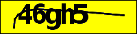
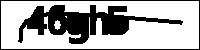
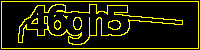

# Init
You can find all functions in cbl.js  

# origin  
範例圖片, 之後為了方便操作, 會移除透明像素.(removeTransparency)  


# removeTransparency(opacity, color)
>Replace transparent pixels with a solid color.  

透明度低於opacity的像素填上color
```js
img.removeTransparency(128, {r: 255, g:255, b:0});
```



# cropRelative(left, top, right, down)  
>Crop an image.  

左上下右切掉固定像素, 縮小分析範圍 
```js
img.cropRelative(25, 0, 65, 5);
```


# colorRegions(tolerance, ignoreWhite, pixelJump)
>Fills each distinct region in the image with a different random color

圖像中的不同區域填上隨機顏色.
tolerance: 隨機度, 愈高愈隨機
ignoreWhite: true-跳過白色區域
pixelJump: 隨機幾個像素跳過不處理
```js
img.colorRegions(128, false, 0);
```


# invert()
>Invert the color of every pixel

反轉像素.  
```js
img.invert()
```


# binarize(threshold)
>Convert the image to black and white given a grayscale threshold  

將亮度高於門檻的, 變成白色, 低於門檻變為黑色  
門檻 = 0.34*r + 0.5*g + 0.16*b  
(範例圖片先做了colorRegions)  
```js
img.binarize(200)
```


# removeLight(brightness)
>Change all colors above a certain brightness to white  

RGB其中一個數值超過門檻的, 變成白色  
(範例圖片先做了colorRegions)  
```js
img.removeLight(200)
```


# removeGray(tolerance)
>Change all semi-gray colors to white  

將所有半灰色改為白色  
(範例圖片先做了colorRegions)  
```js
img.removeGray(128)
```


# grayscale()
>Convert the image to grayscale  

照片轉為灰階  
(範例圖片先做了colorRegions)  
```js
img.grayscale()
```


# erode()
>Apply an erosion filter  

添加蝕刻濾鏡  
```js
img.erode()
```


# convolute(matrix, factor)
>Apply a convolution filter  

添加自定義濾鏡  
```js
img.convolute([[1, 0, 1], [0, 1, 0], [1, 0, 1]], 1 / 3);
```


# blur(level)
>Blur the image (box blur)  

模糊化濾鏡(1~3)  
```js
img.blur(3)
```


# removeHorizontalLine(lineWidth, color)
>Remove a horizontal line from the image (must span the entire picture width)  
將橫線條從圖像中取代為黑色線條.只能刪除完全橫跨圖像的線條  
```js
img.removeHorizontalLine(1, { r: 137, g: 238, b: 206 });
```


# foreach(filter)
>Apply an specific filter to each pixel  
The filter method should accept and return one parameter that will have three properties: r, g, and b  
foreach(function (p) { return p; })  
將每個像素套用至自定義函數  
(範例為找到r:239就替換成黑色)  
```js
img.foreach((pixel) => {
    if (pixel.r == 239) {
        pixel = { r: 0, g: 0, b: 0 }
    }
    return pixel;
});
```


# sharpen()
>sharpen  
銳利化濾鏡  
(範例為套用完foreach)  
```js
img.sharpen()
```

